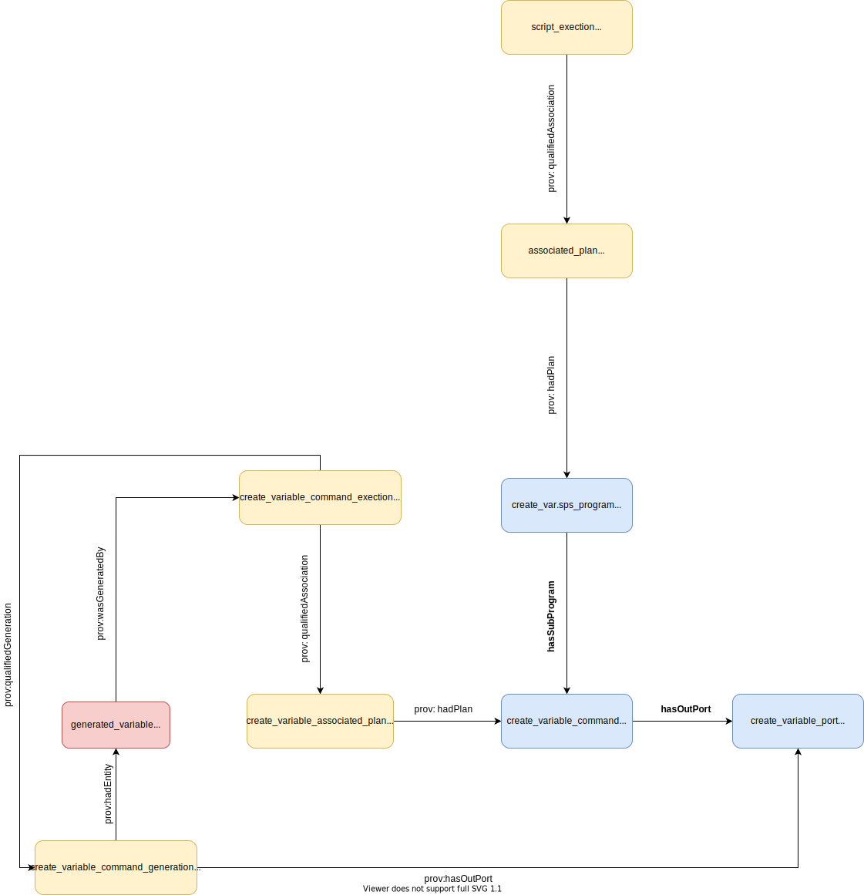

# sdtl-provone
This repository holds a number of different examples and descriptions of SDTL embedded in ProvONE.

## Repository Structure

`single-command/`: Creates a single variable.

`two-commands/`: Creates two variables.

`two-connected-commands/`: Creates a variable which is then used by a second variable.

`three-connected-commands/`: Creates a variable which is used by a second variable. The second variable is used by a third variable.

`two-input/`: Creates two variables and then a third variable that uses uses both of them.

`workflow/`: Shows how multiple files can be part of a provone:Workflow

## Overview
The general idea is to embed SDTL from C2Metadata into a ProvONE representation. This is done by first using `provone:Program`, `provone:Port`, `provone:Channel`, and possible `provone:Workflow` objects to represent commands within script files and the relations between them.

Next, the relevant SDTL is inserted into the appropriate provone objects.


## Describing Script Level Metadata
C2Metadata provides output about the script passed to its parser. A sample of this looks like
```
  "id": "program-1",
  "sourceFileName": "",
  "sourceLanguage": "spss",
  "scriptMD5": "518001a968c359366bf7ceb12bf209ea",
  "scriptSHA1": "3dead21a7b31e1409d2ab364cbf4f734366186ad",
  "sourceFileLastUpdate": "2020-04-14T18:38:10+00:00",
  "sourceFileSize": 19,
  "lineCount": 1,
  "commandCount": 1,
  "parser": "spss-to-sdtl",
  "parserVersion": "0.9 Development",
  "modelVersion": "0.9 Development",
  "modelCreatedTime": "2020-04-14T18:38:10+00:00",
```

### Discarded Terms
Some of these (listed below) don't belong in the a provenance trace.

  `id`: This corresponds to the parser run ID

  `parser`: Which C2Metadata parser the output is from

  `parserVersion`: The parser version

  `modelVersion`

  `modelCreatedTime`

One _could_ create a new provone:Execution that represents the running of the parser. This metadata most likely belongs there however, it's not in scope.


### Terms Kept
The rest of the terms,

  `sourceFileName`: Name of the file (Kept because @id does _not_ need to be the filename)

  `sourceLanguage`: Language of the script
  
  `scriptMD5`: Hash of the script
  
  `scriptSHA1`: Hash of the script
  
  `sourceFileLastUpdate`: The last time the file was modified
  
  `sourceFileSize`: The size of the file
  
  `lineCount`: The number of source lines in the program
  
  `commandCount`: The number of SDTL commands inside

are arguably useful for someone that's interested in the origins of _something_ and are kept for this reason.


### Example
An example can be found in each of the example directories. In `single-command/`, the embedding of the sdtl alongside ProvONE is fairly explicit.

```json
      {
          "@id": "#create_var_program.sps",
          "@type": "provone:Program",
          "provone:hasSubProgram": "#create_variable_command",
          
          "stdl:sourceFileName": "",
          "stdl:sourceLanguage": "spss",
          "stdl:scriptMD5": "518001a968c359366bf7ceb12bf209ea",
          "stdl:scriptSHA1": "3dead21a7b31e1409d2ab364cbf4f734366186ad",
          "stdl:sourceFileLastUpdate": "2020-04-14T18:38:10+00:00",
          "stdl:sourceFileSize": 19,
          "stdl:lineCount": 1,
          "stdl:commandCount": 1
      }
```




## Describing Commands
Commands are the next pieces of interesting output from the SDTL parser. These are the SDTL objects that describe the actual line of source code. In ProvONE, it's modeled using `provone:Program` objects. 

We can define these as "being inside" the top level `provone:program` by relating them with `provone:hasSubProgram`.

An example of a program with three commands inside would, from a provenance perspective, look like

```
{
  "@id": "#my_script.R",
  "@type": "provone:Program",
  "provone:hasSubProgram": [
    {"@id": "#command_1"},
    {"@id": "#command_2"},
    {"@id": "#command_3"},
  ]
}
```

Note that `#my_script.R` is the same level provone:Program as the one described in the File Level Metadata section and would usually contain the script-level SDTL.


A command with the SDTL `command` level metadata resembles
```
{
  "@id": "#command_1",
  "@type": "provone:Program",
  "$type": "Compute",
  "command": "compute",
  "sourceInformation": {
    "lineNumberStart": 1,
    "lineNumberEnd": 1,
    "sourceStartIndex": 1,
    "sourceStopIndex": 19,
    "originalSourceText": "compute newVar = 0."
  },

  "variable": {
    "$type": "VariableSymbolExpression",
    "variableName": "newVar"
  },
  "expression": {
    "$type": "NumericConstantExpression",
    "value": "0",
    "numericType": "int"
  }
}
```

It contains information about where in the script the command is (useful since provenance does not always preserve order), what type of command (in this case `stdl:compute`), and information about the variables used.

## Ports
Ports are objects that represent inputs and outputs to programs. When new variables are created, an associated port is created to represent this. Likewise, when a command uses data, a port is used to represent this usage.

A basic provone:Port has the format
```
{
  "@id": "#command_1_outport",
  "@type": "provone:Port"
}
```


The C2Metadata STL parser provides information about output from commands in the `variable` and `expression` properties.


```
{
  "@id": "#command_1_outport",
  "@type": "provone:Port"
  "variable": {
    "$type": "VariableSymbolExpression",
    "variableName": "newVar"
  },
  "expression": {
    "$type": "NumericConstantExpression",
    "value": "0",
    "numericType": "int"
    }
}
```


### Connecting Programs to Ports
Programs need to be linked to related its related provone:Port(s). This can be done two ways:

1. Using provone:hasOutPort to show output
2. Using provone:hasInPort to show usage

An example of a provone:Program that produces the provone:Port above:
```
{
  "@id": "#command_1",
  "@type": "provone:Program",
  "provone:hasOutPort": {"@id": "command_1_outport"}
}
```

A `provone:Program` can also have multiple inports and outports. Not that the `provone:hasInPort` is using (as the naming implies) the outPort of something else.

```
{
  "@id": "#complex_command",
  "@type": "provone:Program",
  "provone:hasInPort": [
    {"@id": "command_n1_outport"},
    {"@id": "command_n2_outport"},
    {"@id": "command_n31_outport"}
  ],
  "provone:hasOutPort": {"@id": "complex_outport"}
}
```


### Connecting Ports to Ports
Ports can be connected to show that the output of one or many commands is used as the input in another command. `provone:Channel` objects are used to connect the ports to each other. The `provone:Channel` itself doesn't contain much metadata, and there isn't any SDTL embedded in it.

The provone:Channel doesn't contain any SDTL, and the connections are from the related `provone:Port` objects.
```
{
  "@id": "#channel_port1_port2",
  "@type": "provone:Channel"
}
```

The first port would show a connection with
```
{
  "@id": "#port_1",
  "@type": "provone:Port",
  "provone:connectsTo": "channel_port1_port2"
}
```

The second as
```
{
  "@id": "#port_2",
  "@type": "provone:Port",
  "provone:connectsTo": "channel_port1_port2"
}
```

## Describing Workflows
As seen in the previous sections, ProvONE allows the grouping of `provone:Program` by with `provone:hasSubProgram`. We previously used it to describe the relationship between the individual commands in the script and the script itself.

In this section, multiple scripts are grouped together by using a specialization of `provone:Program`: the `provone:Workflow`. From the ProvONE specification,
> A Workflow ◊ is a distinguished Program, which indicates that is meant to represent a computational experiment in its entirety

The following diagram describes the following workflow

1. Execute `clean_data.R` that reads a file in and produces output
1. Execute `analyzed_clean_data.R` that uses the output from step 1 to produce an output.
1. Execute `format_analysis.R` that uses the output of step 2 to create another output.


#### Describing the Script File as a provone:Workflow
The main concern with turning the parent script files into `provone:Worfklow` objects is that it might break compatibility. For example, can we associate a `provone:Execution`?

If there's no issue, it might be more correct to say,


## Adding Executions
The discussion so far has been about abstract inputs and outputs; e haven't actually talked about any actual files on the filesystem and how they relate to the abstract `provone:Port` objects.The goal is to state which `provone:Port` objects were used in the creation or usage of a `provone:Entity`.

Consider a script, plot.py that reads data from a file and produces a plot. For simplicity, we're not concerned with the actual commands inside plot.py. The following is a full provenance trace that connects the output of the `provone:Program` to concrete objects (shown in red)


The provenance objects in red describe concrete files that were touched during the execution (yellow) of the `provone:program` plot.py.

### Link at the Script Level
The first idea is to do something _very_ similar to the diagram above. If we add two commands to the script to first load the data and then output an image, it looks like.


In this example, the `provone:Entity` objects are linked to the `provone:Program`'s ports. Although this is accurate, and completely truthful-we can still say more about the lineage of data. 


#### Connecting With a Channel
Having multiple ports connecting to a `provone:Channel` is valid, and may be done here. By doing so, we're able to make a claim about the relationship between the data (`provone:port`) and a `provone:program` with and the `provone:Entity`.


### Executions of Commands
Just how in the previous section we talked about executions of scripts, we can do the same with commands. This gives a more granular view as to which commands were relevant in the creation or usage of a `provone:Entity`.

In this diagram, the execution of the script is included. The thought is that files can be created and destroyed without having an effect on the script level. In this case there wouldn't be a record of these on the script level.


This diagram is the same as the one above but lacks the top level script information. I kept the basic `prov` links to the `provone:Entity` objects from the top level `provone:Execution`.
