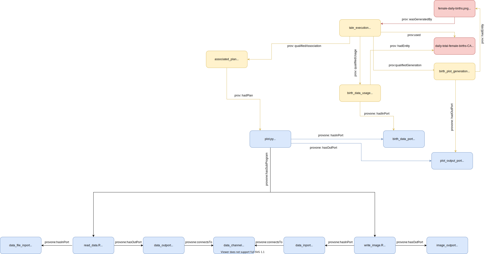

# sdtl-provone


## Repository Structure

`examples/`: Directory holding examples of a ProvONE data model paired
with SDTL 

`images/`: Images found in this README

## Overview

The broad goal is to take SDTL metadata and create an RDF data model
that describes the inner-workings of the script that the SDTL describes.
The ProvONE data model has a sufficient vocabulary to represent the
creation and flow of information in the script. SDTL can then be
embedded in the provone/prov objects to give a much more rich data
model.


## Mapping

Creating provenance from the SDTL happens in three steps:
1. Creating the retrospective model
2. Creating the introspective model
3. Connecting the retrospective and introspective models

I've separated out the instructions for connecting provenance because it
requires the existence of both prospective and retrospective provenance.

### Constructing the Retrospective Provenance
The retrospective provenance is concerned with the following RDF 
objects:
1. provone:Execution
2. prov:Entity
3. prov:Generation
4. prov:Usage
5. prov:Association


The execution of a script is represented with a `provone:Execution`. The
`provone:Execution` _can_ have inputs and outputs however, the top level
`provone:Execution` in this case doesn't. The execution of each command
in the script is also represented by the `provone:Execution`. Also note
that there isn't an object that holds the top level
script-representations, as opposed to the `prov:Workflow` that
prospective provenance has.

Unless noted, referencing `provone:Execution` refers to the _command_
level `provone:Execution`.
 
For each script file:
1. Create a `provone:Execution` to represent the execution of the
   script. This is referred to as the script-level execution.


For each SDTL Command, 
1. Create a new `provone:Execution` 
2. Connect it to the script-level `provone:Execution` with
   `provone:wasPartOf`
3. Create a new `prov:Association` and connect the `provone:Execution`
   to it with `prov:qualifiedAssociation`
   
For each created variable: 
1. Create a `prov:Entity`
2. Connect the `prov:Entity` to the `provone:Execution` with
   `prov:wasGeneratedBy`
3. Create a `prov:Generation`
4. Connect the `prov:Execution` to the `prov:Generation` with
   `prov:qualifiedGeneration`
5. Connect the `prov:Generation` to the `prov:Entity` with
   `prov:hadEntity`


For each used variable:
1. Create or use an existing `prov:Entity` that represents the used
   variable
2. Connect the `provone:Execution` to the entity with `prov:Used`
3. Create a prov:Usage and connect the `prov:Execution` to it with
   `prov:qualifiedUsage
 
 
The relationship between SDTL command executions and the parent
execution representing the script's execution.


### Constructing the Prospective Provenance
The prospective provenance is concerned with the following objects:
1. provone:Program
2. provone:Port
3. provone:Workflow

For each script,
1. Create a `provone:Program` that represents the collection of
   `provone:Program` objects within
2. Create a `provone:Workflow` object if one doesn't already exist
3. Connect the `provone:Workflow` to the new `provone:program` with
   `provone:hasSubProgram`
 
For each command,
1. Create a `provone:Program`
2. Connect the top level `provone:Program` to it with
   `provone:hasSubProgram`

If the `provone:Program` creates a variable:
1. Create a `provone:Port`
2. Connect the `provone:Program` to it with `provone:hasOutPort`

If the `provone:Program` uses a variable Note that the variable being
used _should_ be connected to a channel
1. Create a `provone:Port`
2. Connect it to the target `provone:Channel` with `provone:connectsTo`
3. Connect the `provone:Program` to it with `provone:hasInPort` 


### Connecting Retrospective & Prospective
The retrospective and prospective models are connected by the following
objects:
1. prov:Association
2. prov:Generation
3. prov: Association
4. provone:Port
5. provone:Program
6. provone:Channel
 
 The first three objects are retrospective while the
   last two are prospective. The two areas are connected by the inputs
   and outputs (the channel and prov:Entity).

For each created variable:
1. A `prov:Entity` and `provone:Port` should already exist representing
   the new variable
2. A `prov:Generation` should already exist
3. Connect the `prov:Generation` to the `provone:Port`

For each used variable:
1. Connect the `provone:Execution` to the used `prov:Entity` with
   `prov:Used`
2. Create a new `provone:Port` that represents the input.
3. If the output port from the `provone:Program` that created the
   variable being used is present
3. Create a provone: `provone:Program`


## Script Level Metadata
C2Metadata provides output about the script passed to its parser. A sample of this looks like
```
  "id": "program-1",
  "sourceFileName": "",
  "sourceLanguage": "spss",
  "scriptMD5": "518001a968c359366bf7ceb12bf209ea",
  "scriptSHA1": "3dead21a7b31e1409d2ab364cbf4f734366186ad",
  "sourceFileLastUpdate": "2020-04-14T18:38:10+00:00",
  "sourceFileSize": 19,
  "lineCount": 1,
  "commandCount": 1,
  "parser": "spss-to-sdtl",
  "parserVersion": "0.9 Development",
  "modelVersion": "0.9 Development",
  "modelCreatedTime": "2020-04-14T18:38:10+00:00",
```

This metadata is most closely associated with the top level
`provone:Program` and `provone:Exection`.


### Discarded Terms
Some of these (listed below) don't belong in the a provenance trace.

  `id`: This corresponds to the parser run ID. The provone:Execution or
  provone:Program will already have a unique ID.

  `parser`: Which C2Metadata parser the output is from

  `parserVersion`: The parser version

  `modelVersion`

  `modelCreatedTime`


### Terms Kept
The rest of the terms,

  `sourceFileName`: Name of the file (Kept because @id does _not_ need to be the filename)

  `sourceLanguage`: Language of the script
  
  `scriptMD5`: Hash of the script
  
  `scriptSHA1`: Hash of the script
  
  `sourceFileLastUpdate`: The last time the file was modified
  
  `sourceFileSize`: The size of the file
  
  `lineCount`: The number of source lines in the program
  
  `commandCount`: The number of SDTL commands inside


### Embedding
 
 
 

```json
      {
          "@id": "#create_var_program.sps",
          "@type": "provone:Program",
          "provone:hasSubProgram": "#create_variable_command",
          
          "sdtl:sourceFileName": "",
          "sdtl:sourceLanguage": "spss",
          "sdtl:scriptMD5": "518001a968c359366bf7ceb12bf209ea",
          "sdtl:scriptSHA1": "3dead21a7b31e1409d2ab364cbf4f734366186ad",
          "sdtl:sourceFileLastUpdate": "2020-04-14T18:38:10+00:00",
          "sdtl:sourceFileSize": 19,
          "sdtl:lineCount": 1,
          "sdtl:commandCount": 1
      }
```


## Describing Commands
In ProvONE, command level metadata is modeled using `provone:Program`.
objects.

We can define these as "being inside" the top level `provone:program` by relating them with `provone:hasSubProgram`.

An example of a program with three commands inside would, from a provenance perspective, look like

```
{
  "@id": "#my_script.R",
  "@type": "provone:Program",
  "provone:hasSubProgram": [
    {"@id": "#command_1"},
    {"@id": "#command_2"},
    {"@id": "#command_3"},
  ]
}
```

Note that `#my_script.R` is the same level provone:Program as the one described in the File Level Metadata section and would usually contain the script-level SDTL.


A `provone:Program` with SDTL `command` level metadata looks like
```
{
  "@id": "#command_1",
  "@type": "provone:Program",
  "$type": "Compute",
  "command": "compute",
  "sourceInformation": {
    "lineNumberStart": 1,
    "lineNumberEnd": 1,
    "sourceStartIndex": 1,
    "sourceStopIndex": 19,
    "originalSourceText": "compute newVar = 0."
  },

  "variable": {
    "$type": "VariableSymbolExpression",
    "variableName": "newVar"
  },
  "expression": {
    "$type": "NumericConstantExpression",
    "value": "0",
    "numericType": "int"
  }
}
```

It contains information about where in the script the command is (useful since provenance does not always preserve order), what type of command (in this case `sdtl:compute`), and information about the variables used.

## Ports
Ports are objects that represent inputs and outputs to programs. When new variables are created, an associated port is created to represent this. Likewise, when a command uses data, a port is used to represent this usage.

A basic provone:Port has the format
```
{
  "@id": "#command_1_outport",
  "@type": "provone:Port"
}
```


The C2Metadata STL parser provides information about output from commands in the `variable` and `expression` properties.


```
{
  "@id": "#command_1_outport",
  "@type": "provone:Port"
  "variable": {
    "$type": "VariableSymbolExpression",
    "variableName": "newVar"
  },
  "expression": {
    "$type": "NumericConstantExpression",
    "value": "0",
    "numericType": "int"
    }
}
```


### Connecting Programs to Ports
Programs need to be linked to related its related provone:Port(s). This can be done two ways:

1. Using provone:hasOutPort to show output
2. Using provone:hasInPort to show usage

An example of a provone:Program that produces the provone:Port above:
```
{
  "@id": "#command_1",
  "@type": "provone:Program",
  "provone:hasOutPort": {"@id": "command_1_outport"}
}
```

A `provone:Program` can also have multiple inports and outports. Not that the `provone:hasInPort` is using (as the naming implies) the outPort of something else.

```
{
  "@id": "#complex_command",
  "@type": "provone:Program",
  "provone:hasInPort": [
    {"@id": "command_n1_outport"},
    {"@id": "command_n2_outport"},
    {"@id": "command_n31_outport"}
  ],
  "provone:hasOutPort": {"@id": "complex_outport"}
}
```
Note that this is the same image from the section above. It's included here to review after reading this section


### Connecting Ports to Ports
Ports can be connected to show that the output of one or many commands is used as the input in another command. `provone:Channel` objects are used to connect the ports to each other. The `provone:Channel` itself doesn't contain much metadata, and there isn't any SDTL embedded in it.

The provone:Channel doesn't contain any SDTL, and the connections are from the related `provone:Port` objects.
```
{
  "@id": "#channel_port1_port2",
  "@type": "provone:Channel"
}
```

The first port would show a connection with
```
{
  "@id": "#port_1",
  "@type": "provone:Port",
  "provone:connectsTo": "channel_port1_port2"
}
```

The second as
```
{
  "@id": "#port_2",
  "@type": "provone:Port",
  "provone:connectsTo": "channel_port1_port2"
}
```


## Describing Workflows
As seen in the previous sections, ProvONE allows the grouping of `provone:Program` by with `provone:hasSubProgram`. We previously used it to describe the relationship between the individual commands in the script and the script itself.

In this section, multiple scripts are grouped together by using a specialization of `provone:Program`: the `provone:Workflow`. From the ProvONE specification,
> A Workflow ◊ is a distinguished Program, which indicates that is meant to represent a computational experiment in its entirety

The following diagram describes the following workflow

1. Execute `clean_data.R` that reads a file in and produces output
1. Execute `analyzed_clean_data.R` that uses the output from step 1 to produce an output.
1. Execute `format_analysis.R` that uses the output of step 2 to create another output.


#### Describing the Script File as a provone:Workflow
The main concern with turning the parent script files into `provone:Worfklow` objects is that it might break compatibility. For example, can we associate a `provone:Execution`?

If there's no issue, it might be more correct to say,


## Adding Executions
The discussion so far has been about abstract inputs and outputs; we haven't actually talked about any actual files on the filesystem and how they relate to the abstract `provone:Port` objects.The goal is to state which `provone:Port` objects were used in the creation or usage of a `provone:Entity`.

Consider a script, plot.py that reads data from a file and produces a plot. For simplicity, we're not concerned with the actual commands inside plot.py. The following is a full provenance trace that connects the output of the `provone:Program` to concrete objects (shown in red)


The provenance objects in red describe concrete files that were touched during the execution (yellow) of the `provone:program` plot.py. Note that this is at the _script_ level.

### Link at the Script Level
The first idea is to do something _very_ similar to the diagram above. If we add two commands to the script to first load the data and then output an image, it looks like.



In this example, the `provone:Entity` objects are linked to the `provone:Program`'s ports. Although this is accurate, and completely truthful-we can still say more about the lineage of data. 


#### Connecting With a Channel
Having multiple ports connecting to a `provone:Channel` is valid, and may be done here. By doing so, we're able to make a claim about the relationship between the data (`provone:port`) and a `provone:program` with and the `provone:Entity`.


#### Inaccuracies
The diagram in this section is similar to the others, but there's a twist: a third command is present that doesn't have any effect on the image. Let's pretend that the third command says
```COMPUTE a=1+1```. By the logic in the sections above, this command is related to the image file when in reality it's not.


One solution is to the Channel concept and not connect the unrelated port to it. Another solution is to model the execution of commands, which gives far more control over what is meant by output and input.

### Executions of Commands
Just how in the previous section we talked about executions of scripts, we can do the same with commands. This gives a more granular view as to which commands were relevant in the creation or usage of a `provone:Entity`.

In this diagram, the execution of the script is included. The thought is that files can be created and destroyed without having an effect on the script level. In this case there wouldn't be a record of these on the script level.


This diagram is the same as the one above but lacks the top level script information about the Entity. This _should_ give the same amount of information as the previous example: The origin of each `provone:Entity` can be traced back to the execution of `plot.py`. I say that this is _implicit_ because it's not an explicit relation on the plot.py execution but is possible to figure out.
