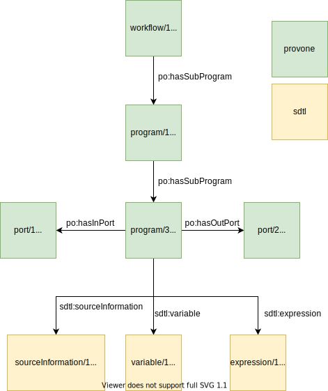

# sdtl-provone


## Overview

This repository goes over the ProvONE-SDTL Data Model.


### Purpose
The purpose of the data model is to take information that's represented in SDTL and transform it 
into the ProvONE data model, allowing queries to be made using ProvONE syntax.

Target Queries:

1. What input data frames influenced the operation of a particular command?
2. What output data frames were affected by a particular command?
3. For a particular output, what were the preceding commands in its lineage?
4. For a given data frame, what other data frame depended on it in some way?.

All of these queries can be restated in terms of ProvONE

1. What were the input data frames to a provone:Program or provone:Execution?
2. Given a particular provone:Program or provone:Execution, what were its inputs (Port or Entity) that were created from another Execution or Program?
3. For a particular Port or Entity, what were the Programs or Executions in its lineage
4. For a given Port or Entity, what other Ports or Entities depended on it in some way?


### RDF Identifier Scheme & Format
One of the main goals of specifying an identifier scheme is to ensure more human readable identifiers. This is particularly important for reading query results. The naming convention for identifiers was taken from the `Patterned
URIs` section in [Linked Data Patterns](https://patterns.dataincubator.org/book/).

The general form is,

`#camelCaseClass/{current_type_count}`. where `{current_type_count}` is the
count of the particular object.

#### Labels
Every object should have an `rdfs:label` when possible & appropriate.
The top level provone:Workflow and provone:Execution object can have pre-defined labels because they represent unique nodes with a specific purpose.

Script level provone:Program & provone:Execution object also have labels, letting any query-er know that they're observing entities that resemble script files.

#### Format
The target format is JSON-LD; rdflib has a plugin for turning its graph model into JSON-LD. Turtle is still the easiest to parse by eye, so the examples in this document are provided  in Turtle. Examples in the `examples/` directory are in both Turtle and JSON-LD.

## SDTL-ProvONE Data Model
Because the model is centered around ProvONE queries targeting questions about data flow, the underlying architecture is predominantly ProvONE.

### Outer Workflow & Execution
ProvONE has the ability to represent workflows and collections of executions, `provone:Workflow` & `provone:Exection`. These are most commonly used to represent the execution of a series of scripts, or the existence of a series. Note that these are unordered.


Every ProvONE representation will have a similar outer structure for representing the collection of scripts. Prospective provenance collects each script-representing-node under a provone:Workflow; retrospective provenance collects each script-execution-node under a provone:Execution.

#### Prospective
Every prospective model will have a provone:Program that represents the script that was parsed by C2Metadata and a provone:Workflow that the script belongs to. Every script-level provone:Program is attached to the provone:Workflow.


Consider two source files in a single data package. A single `provone:Workflow` object contains both nodes that represent the file.


#### Retrospective
Every retrospective model will have a provone:Execution that represents the hypothetical execution of a script that was parsed by C2Metadata. Every provone:Execution object that represents a script will be attached to the top level provone:Execution


Retrospective provenance is described similarly. In this case however, there is no specific type to denote a 'collection' of executions. Instead, wasPartOf can be used to denote grouping.


### Command Level Provenance
Commands inside a script file are defined with `provone:Program` and `provone:Execution` objects. The objects describing the data flow between these objects are the standard `provone:Port` and `provone:Entity`. 

This can be restated: every SDTL object that has base class CommandBase is translated into a provone:Program or provone:Execution. Alternatively: Every JSON object object that is in the SDTL "commands" array is mapped to a provone:Program or provone:Execution.

Note that although the SDTL may be ordered in regards to command execution, ProvONE does not have an object that can encode the order.


#### Prospective 

Commands are related to the script-level provone:Program via `provone:hasSubProgram`. Take for example a script that has four commands inside. These are modeled in ProvONE as,


Data flow in prospective ProvONE utilized the `provone:Port` and `provone:Workflow` objects.
For example, consider this snippet of SDTL that represents a "Load" command. Note that the command is in the "commands" array.

```
"commands": [
  {
    "$type": "Load",
    "fileName": "df.csv",
    "software": "csv",
    "producesDataframe": [
      {
        "dataframeName": "df",
        ],
      }
  }
]
```

From the type of command, it's clear that a file is being used. This file is represented as `port/1`. From `producesDataFrame` we can infer that a new port is created to represent the data frame, `port/2`.


If a second command is added, one that uses the data frame, then the `provone:Channel` object will be used to connect the port object. For example, consider the SDTL below that describes a 'Load' command, and thn a command that uses its data frame and produces a new one.

```
"commands": [
  {
    "$type": "Load",
    "fileName": "df.csv",
    "software": "csv",
    "producesDataframe": [
      {
        "dataframeName": "df",
        ],
      }
  },
  {
  "$type": "Compute",
  "consumesDataframe": [
    {
      "dataframeName": "df",
    }
    "producesDataframe": [
    {
      "dataframeName": "df"
    }
  }
]
```


Visually, 


This form can be repeated to form arbitrarily long chains of data flows between commands in a script. The form will _always_ use the `provone:Program` type to represent the command and the `provone:Port` to represent a file or data frame.


#### Retrospective

Retrospective provenance works in a similar way in that commands are represented as sub-executions of a parent script file execution.

The following image depicts a script that has four commands inside.


Data flow with retrospective provenance is a little more involved than prospective provenance. 

Using the 'Load' command SDTL that was used for prospective provenance,

```
"commands": [
  {
    "$type": "Load",
    "fileName": "df.csv",
    "software": "csv",
    "producesDataframe": [
      {
        "dataframeName": "df",
        ],
      }
  }
]
```

In the image below, `entity/1` represents the file being used by the command. `entity/2` represents the data frame that was created.


### The SDTL Data Frame
The `provone:Port` & `provone:Entity` objects in the section above can be more useful to additional queries if some of the metadata about the data frame is preserved.

A full data frame description contains information about the variables inside and the name of the data frame in the source code. Consider a command that loads a data frame which has variables inside from a file,

```
{
  "$type": "Load",
  "command": "Load",
  "fileName": "df.csv",
  "software": "csv",
  "producesDataframe": [
    {
      "dataframeName": "df",
      "variableInventory": [
        "A",
        "B"
      ]
    }
  ],
}
```

The data frame object has the following RDF representation under ProvONE. Note that the root node is a provone:Port.


#### Attaching to provone:Port Objects
The data frame objects can be attached to the provone:Port that its associated with. Take for example, the following SDTL that loads a data frame from a file and then reads uses the data frame in a new command.

```
{
  "$type": "Load",
  "command": "Load",
  "fileName": "df.csv",
  "software": "csv",
  "producesDataframe": [
    {
      "dataframeName": "df",
      "variableInventory": [
        "A",
        "B"
        ]
    }
  ]
},
{
  "$type": "Compute",
  "command": "Compute",
  "consumesDataframe": [
    {
      "dataframeName": "df",
        "variableInventory": [
          "A",
          "B"
        ]
    }
  ],
  "producesDataframe": [
    {
      "dataframeName": "df",
      "variableInventory": [
        "A",
        "B"
      ]
    }
  ]
}
```


Note that in this case, the second data frame, `port/4` has the same attributes as `port/2`. This does _not_ mean that the two data frames are the same. The state of its variables _could_ be different. This model is not interested in asking _how_ they're different.

### ProvONE Structure With Additional SDTL
The ProvONE model can be extended to include additional properties from the SDTL. This can be done to provide greater context about what happened within each command. Each SDTL command has a different metadata structure for the type of command.

For example, the [KeepCases](https://gitlab.com/c2metadata/python-to-sdtl/-/blob/master/test/sdtl/cases.json) command has a property called[condition](https://gitlab.com/c2metadata/python-to-sdtl/-/blob/master/test/sdtl/cases.json#L40).

The [renames](https://gitlab.com/c2metadata/python-to-sdtl/-/blob/master/test/sdtl/rename.json) command has a property called [renames](https://gitlab.com/c2metadata/python-to-sdtl/-/blob/master/test/sdtl/rename.json#L65).

These are all attached to the command-level provone:Program, shown below




## Open Considerations

### Hybrid Types
It seems that the provone:Program representing a command can _also_ be an SDTL CommandBase. This allows for more seamless hybrid queries, 

What is the provone:Program that is also an sdlt:Load?

What are the provone:Ports to all commands of type sdtl:Load?

What are the input provone:Ports to the sdt:Load command with X property?

## Summary

The proposed model transforms sdtl:CommandBase objects into provone:Program objects, attaches a data frame representation to its provone:Port objects, and attaches selected SDTL properties to the provone:Program.

This model allows for querying about data flow through the script, using ProvONE. The additional SDTL objects (SourceInformation, expression, etc) can be queried using the SDTL language to determine more information about the command in question.
