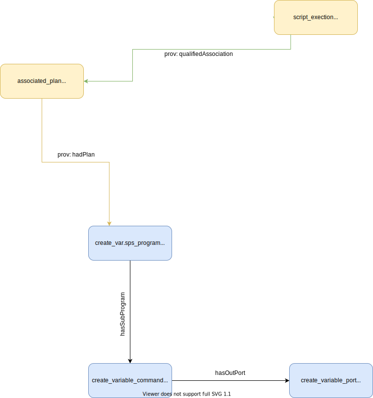

# Single Command Example

This is an example of a SPSS program that has a single line/command. The script in question is [create_var.sps](./create_var.sps). You can find the JSON-LD representation in [prov.jsonld](./prov.jsonld).




### Prov Model Notes
The `create_variable_command` is related to the overall script file via the `hasSubProgram` relation because the command is recursively inside the script file (recall that hasSuProgram is recursive). 


### SDTL Embedding Notes


#### File Level Metadata
The chunk of SDTL that gives high level metrics about the _file holding  the commands_ should be embedded in the ProvONE object that represents the overall file. In this case, that object is `create_var.sps_program`.

File Level SDTL
```
  "id": "program-1",
  "sourceFileName": "",
  "sourceLanguage": "spss",
  "scriptMD5": "518001a968c359366bf7ceb12bf209ea",
  "scriptSHA1": "3dead21a7b31e1409d2ab364cbf4f734366186ad",
  "sourceFileLastUpdate": "2020-04-14T18:38:10+00:00",
  "sourceFileSize": 19,
  "lineCount": 1,
  "commandCount": 1,
  "parser": "spss-to-sdtl",
  "parserVersion": "0.9 Development",
  "modelVersion": "0.9 Development",
  "modelCreatedTime": "2020-04-14T18:38:10+00:00"
  ```

#### Command Level Metadata

The metadata about the command can naturally be paired with the ProvONE object that represents this entity. In this case, it's `create_variable_command`.

Command Level Metadata
```
  "commands": [
    {
      "$type": "Compute",
      "command": "compute",
      "sourceInformation": {
        "lineNumberStart": 1,
        "lineNumberEnd": 1,
        "sourceStartIndex": 1,
        "sourceStopIndex": 19,
        "originalSourceText": "compute newVar = 0."
      },
      "variable": {
        "$type": "VariableSymbolExpression",
        "variableName": "newVar"
      },
      "expression": {
        "$type": "NumericConstantExpression",
        "value": "0",
        "numericType": "int"
      }
    }
  ]
```
#### Variable Level Metadata
Some of the command level metadata _also_ describes the output from the command. In this case there's a variable, `newVar` that's created. This naturally fits into the notion of a `provone:Port` which is associated with the command via `provone:hasOutPort`.

Variable Level Metadata
```
      "variable": {
        "$type": "VariableSymbolExpression",
        "variableName": "newVar"
      },
      "expression": {
        "$type": "NumericConstantExpression",
        "value": "0",
        "numericType": "int"
      }
```
