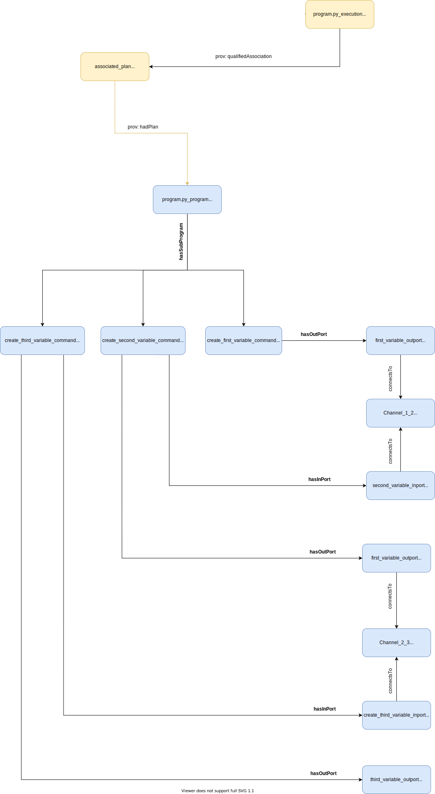

## Three Connected Commands

This example shows how command outputs and inputs can be chained many times to show the flow of data.

### Visual Representation

### Prov Model Notes
The provenance model in this example is just an extension of the `two-connected-commands` example with a third command instead of just two.

### SDTL Embedding Notes
There isn't anything new in the example with the SDTL embedding.
