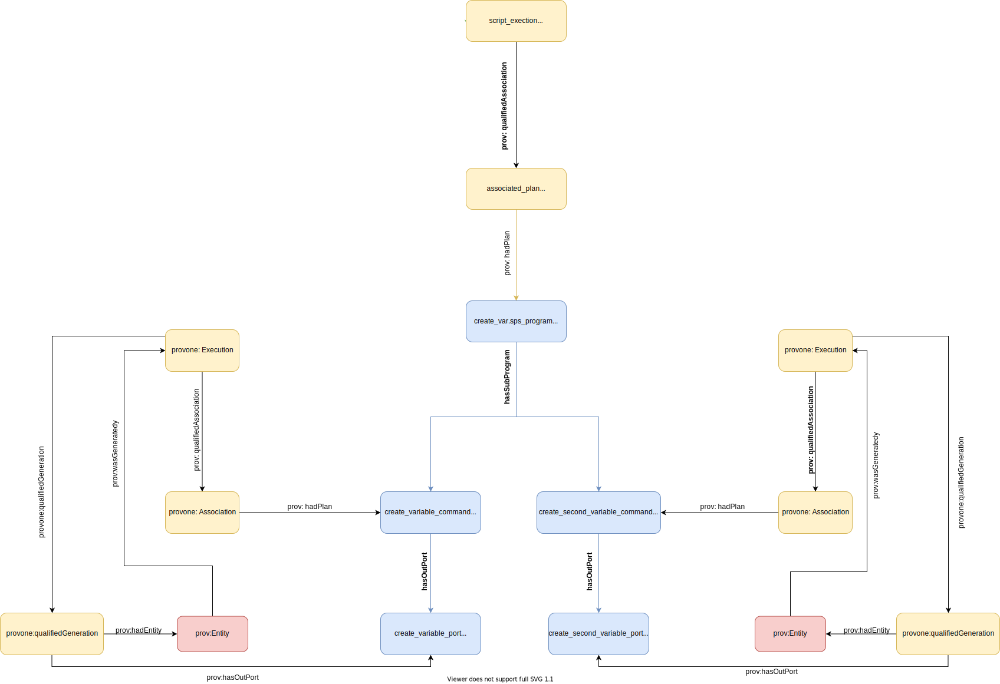

# Two Commands Example

This is an example of an SPSS program that creates two variables that are independent of each other.

### Visual Representation


### Prov Model Notes
The main difference between this example and the single command example is that the main `provone:Program` has two `provone:Program` objects directly underneath it, connected via `provone:hasSubProgram`.

```
{
  "@id": "#create_var.sps",
  "@type": "provone:Program",
  "provone:hasSubProgram": [
    {"@id": "#create_variable_command"},
    {"@id": "#create_second_variable_command"}
  ],
  .
  .
  .
}
```

### SDTL Embedding Notes
There isn't much to say about how the SDTL is embedded since its similar to the single command example: the variable metadata gets put in the related `Port` and the entire command in the `provone:Program`. Since both commands are in a single file, the file level metadata is placed in the top level `provone:Program`.