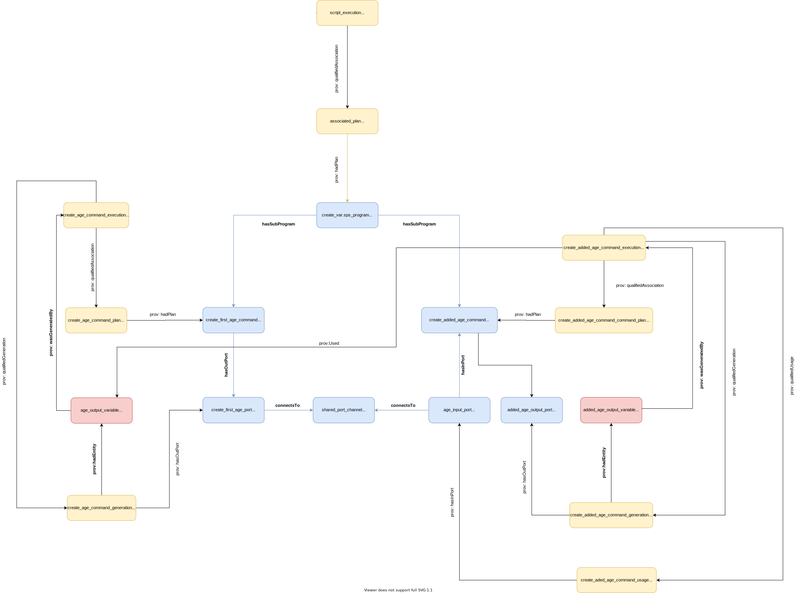

# Two Connected Commands Example

This is an example of an SPSS program that
 1. Creates a variable
 2. Creates a second variable, using the first
  
 This is designed to show a simple case where the output of one command is used as the input to another.

### Visual Representation

### Prov Model Notes

The main addition to this example is the `provone:Channel` that links the output from `create_age_command` to the input of `crete_added_age_command`.

The Channel does _not_ contain any SDTL; The connected ports already contain all of the relevant information about each command.

### SDTL Embedding Notes
There aren't any changes to the way the SDTL is embedded since this is a pure provone addition.