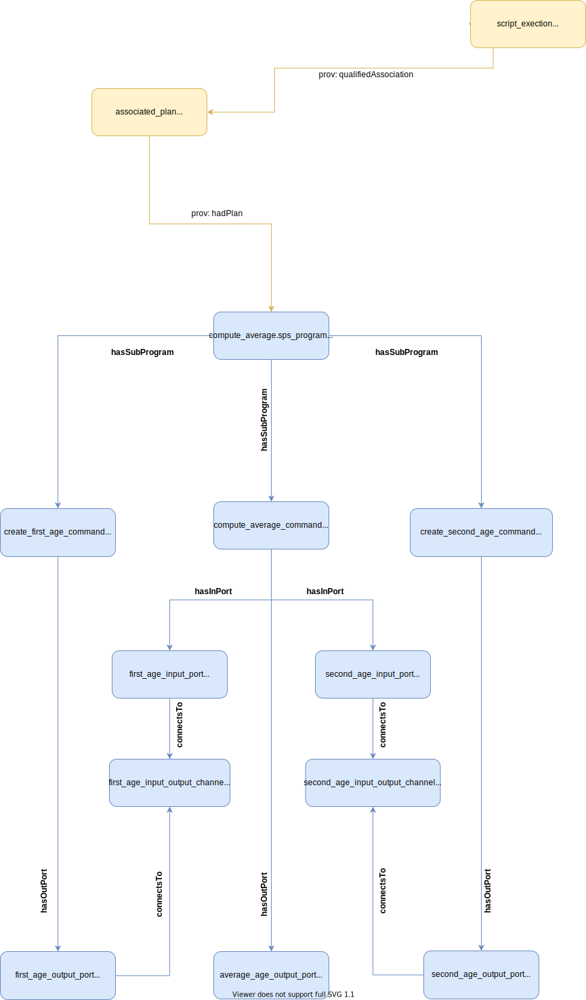

## Two Input Example

This example shows how a command can use data from two previous commands. In this case, two age variables are created and then a third variable computes the average of them.

### Visual Representation

### Prov Model Notes
The provenance model centered around this builds off of the idea of provone:Port and provone:Channel. Although there aren't any new concepts here, its a realistic example of how these terms can be combined to represent more realistic situations. The command that does the averaging, `compute average_age = (first_age+second_age)/2.`, has two input ports: one for the `first_age` and the second for the `second_age` variables.

### SDTL Embedding Notes
Despite this being a more complex example, the SDTL is embedded in all the standard places: in the provone:Program and provone:Port objects.